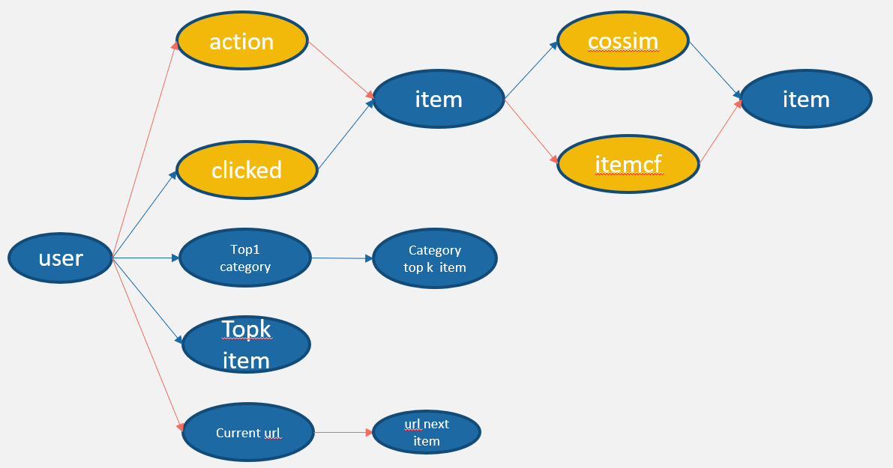

## Summary

Our best result is simple and robust, which is just a weighted ensemble of the results of the two recalls. Although our plan looks simple, many details and creative ideas are still invovled in it. We cleaned the ineffective code and only submitted the simplest code that can achieve the best results for better readability.

## Solution

### Recall

We tried many recall approaches, and finally selected only two best recalls. 

1. u2i_interact_i2i_itemcf：

   ​	First calculate the similarity between the item and item through collaborative filtering; then the user recommends the most similar item based on the historical interactive items. 

2. u2url_url2i：

   Count the probability of visiting each item next time after visiting the current URL; then recommend items with high probability according to the user's last URL. 

Note: In the source code, we denote "product_sku_hash" in the original dataset as "item", and denote "session_id_has" as "user".

#### Results

For the stage II, we use u2url_url2i to get a score of 0.269, and then use it to integrate with u2i_interact_i2i_itemcf to achieve the highest score of 0.277. 

### Ranking

We also tried many methods for ranking, but the result did not improve.

